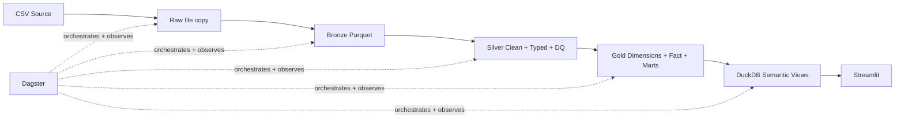

# Architecture

Raw preserves the received physical file at `data/raw/servidores/servidores-2026.csv`. The inspected source contains two competencies (`202601`, `202602`), but Raw is intentionally not partitioned by `ano_mes`; partitioning or analytical organization can happen later in Bronze, Silver or Gold after the source has been preserved.

Dagster is not a data layer. It is the orchestrator that understands asset dependencies, executes materializations and exposes lineage/observability for the class demo.
